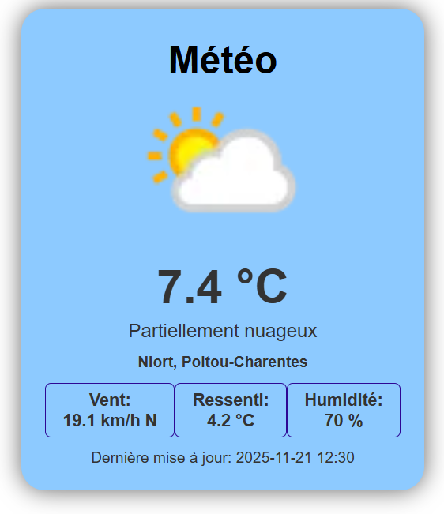

# Application Météo - Transports en Commun

## Aperçu


## Description
Application web d'affichage météo destinée aux écrans d'information dans les transports en commun.

## Fonctionnalités
- Affichage en temps réel des données météo
- Configuration par ville via fichier JSON
- Mise à jour automatique toutes les heures
- informations météo lisible sans doute possible
- Gestion des erreurs de récupération de données

## Technologies utilisées
- HTML5
- CSS3
- JavaScript
- API WeatherAPI
- Git/GitHub

## Installation & Configuration

### 1. Cloner le dépôt
```bash
git clone https://github.com/titus-79/weather-app
cd [NOM_DU_DOSSIER]
```

### 2. Configurer la ville
Modifier le fichier `conf.json` :
```json
{
    "ville": "Niort",
    "api_key": "VOTRE_CLE_API"
}
```

### 3. Lancer l'application
Utiliser un serveur local pour éviter les problèmes CORS :

**Avec VS Code :**
- Installer l'extension "Live Server"
- Clic droit sur `index.html` > "Open with Live Server"

Puis ouvrir : `http://localhost:5500`

## Structure du projet
```
.
├── index.html          # Interface principale
├── style.css           # Styles de l'application
├── meteo.js            # Logique JavaScript
├── conf.json           # Configuration (ville + clé API)
└── README.md           # Documentation
```

## API utilisée
- **WeatherAPI** : https://www.weatherapi.com/
- Endpoint : `/v1/current.json`
- Langue : Français (`lang=fr`)

## Données affichées
- Température actuelle
- Conditions météorologiques (texte + icône)
- Ville et région
- Vitesse et direction du vent
- Température ressentie
- Taux d'humidité
- Dernière mise à jour

## Auteur
Rodolphe - Projet CDA 2025

## Licence
Projet académique
Libre d'utilisation à des fins éducatives